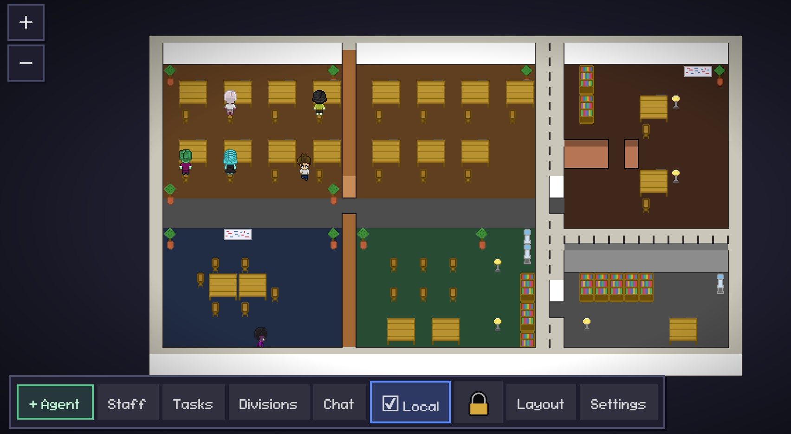

<div align="center">
  <h1>Pixels Office Empire</h1>
  <p><b>AI Agents Virtual Office</b> — an autonomous multi-agent ecosystem you can see and run.</p>
  <p>
    <a href="#english">English</a> ·
    <a href="#portugu%C3%AAs">Português</a>
  </p>
  
</div>

---

## English

### What this is

A pixel-art “virtual office” in the browser: AI agents appear as characters, chat in real time, manage tasks/divisions, and execute actions via tools (filesystem, shell, web, deploy, integrations).

### Why it’s impressive

- **Multi-agent delegation**: agents assign work to each other with a real task queue (`create_task`) and broadcast directives to the whole team.
- **Execution-first loop**: agents think in cycles (default: 25s), pick the next pending task, and act (message, tool, complete).
- **Tool-driven output**: agents can scaffold projects, write/read/search files, run shell commands, and browse the web, then feed results back into their next step.
- **Self-tracking tasks**: when a task includes steps like `use_tool ...`, the system can mark steps as done (OK) after a successful run.
- **Human-in-the-loop when needed**: if an agent needs access/approval, it can message the owner (“Dono”) directly from the system.
- **Vault-backed integrations**: credentials are stored in SQLite (Vault) and consumed by backend tools without hardcoding secrets in the repo.

### What’s inside

- **Frontend** ([frontend/](frontend)): React + Vite + TypeScript, 2D canvas pixel-art office UI
- **Backend** ([backend/](backend)): Node.js + TypeScript + Express + Socket.IO + SQLite (API + real-time + agent orchestration)
- **Persistence**: SQLite (`orchestrator.db`) is created at runtime in `./data/` (local) or `/data/` (Docker). This folder is ignored by Git by default.

### How it works (quick view)

- **Agents**: each agent has a name, role, and prompt; they think in cycles and can message, create tasks, and run tools.
- **Tasks**: execution queue with status (pending/running/done/error).
- **Divisions**: objectives/projects that group tasks and define direction.
- **Vault**: credentials store (tokens/API keys) in the database, used by backend tools (deploy/integrations).
- **Real-time**: Socket.IO syncs chat, movement, activities, and effects.

### Run with Docker (recommended)

```bash
docker compose up --build
```

- Frontend (UI): http://localhost:5173
- Backend (API): http://localhost:3000

Stop and also delete DB/volumes:

```bash
docker compose down -v
```

### Run locally (no Docker)

Backend:

```bash
cd backend
npm install
npm run dev
```

Frontend:

```bash
cd frontend
npm install
npm run dev
```

### Configuration

The `docker-compose.yml` provides dev defaults. Typically you will adjust:

- **LLM base URL/model** via backend environment variables (e.g. `LLM_BASE_URL`, `LLM_MODEL`).
- **Credentials** via the Vault panel in the UI (stored in SQLite and consumed by backend tools).

### Security

- Do not push databases/exports to GitHub: `./data`, `*.db`, and `vault_export*.txt` are already ignored in `.gitignore`.
- If you upload via ZIP/drag-and-drop to GitHub, delete `data/` before uploading.
- To wipe Docker data (containers + DB volume): `docker compose down -v`.

### Donations

If this project helps you, consider supporting it:

<table>
  <tr>
    <td valign="top">
      <b>PIX (Brasil)</b><br />
      Chave: <code>+5535997541511</code><br />
      <br />
      <b>Crypto</b><br />
      MetaMask (ETH/BSC/Polygon):<br />
      <code>0x5da643C6d0E72C18fa5D63178Ea116e1309BD9d0</code><br />
      <br />
      Solana (SOL):<br />
      <code>YQLE7Heob5oXKy4nyjQCPP46xdFKzbTh7EGJ5jmTA1v</code><br />
      <br />
      Sui Network:<br />
      <code>0x2d9e999dd90ff4fdf321c01e1d6c3a2785ff4fcae3c67853a694d61aae82a233</code><br />
    </td>
    <td valign="top">
      <b>Your donation helps to</b><br />
      🚀 Build new features<br />
      🛡️ Keep the system secure<br />
      📚 Create docs and tutorials<br />
      ❤️ Keep it free and open-source<br />
    </td>
  </tr>
</table>

### Contributing

- Fork the repo
- Create a branch: `git checkout -b feature/AmazingFeature`
- Commit: `git commit -m "Add some AmazingFeature"`
- Push: `git push origin feature/AmazingFeature`
- Open a Pull Request

### License

MIT — see [LICENSE](LICENSE)

### Developer

- Thales Philipi
- LinkedIn: https://www.linkedin.com/in/thalesphilipi/
- Website: https://nexapp.com.br

---

## Português

### O que é

Um “escritório virtual pixelado” no navegador: agentes de IA aparecem como personagens, conversam em tempo real, organizam tarefas/divisões e executam ações via ferramentas (filesystem, shell, web, deploy e integrações).

### Por que impressiona

- **Delegação multi-agente**: agentes delegam tarefas uns aos outros com uma fila real (`create_task`) e também conseguem “broadcast” para o time inteiro.
- **Loop focado em execução**: os agentes pensam em ciclos (padrão: 25s), pegam a próxima tarefa pendente e agem (mensagem, ferramenta, conclusão).
- **Entrega via ferramentas**: conseguem scaffold de projeto, escrever/ler/buscar arquivos, rodar shell e navegar na web, usando o resultado no próximo passo.
- **Autogestão de tarefas**: quando a tarefa vem com passos `use_tool ...`, o sistema marca o passo como (OK) depois que roda com sucesso.
- **Humano no loop quando precisa**: se faltar acesso/aprovação, o agente manda mensagem direto pro Dono dentro do sistema.
- **Integrações via Vault**: credenciais ficam no SQLite (Cofre) e são usadas pelas ferramentas do backend sem “hardcode” de segredo no repo.

### O que tem aqui

- **Frontend** ([frontend/](frontend)): React + Vite + TypeScript, canvas 2D pixel-art (UI do “escritório”)
- **Backend** ([backend/](backend)): Node.js + TypeScript + Express + Socket.IO + SQLite (API + tempo real + orquestração dos agentes)
- **Persistência**: SQLite (`orchestrator.db`) é criado em runtime em `./data/` (local) ou `/data/` (Docker). Essa pasta fica ignorada no Git por padrão.

### Como funciona (visão rápida)

- **Agentes**: cada agente tem nome, papel e prompt; eles pensam em ciclos e podem conversar, criar tarefas e executar ferramentas.
- **Tasks**: fila de execução com status (pending/running/done/error).
- **Divisions**: objetivos/projetos que agrupam tarefas e dão direção.
- **Vault (Cofre)**: credenciais (tokens/API keys) no banco, usadas por ferramentas do backend (deploy/integrações).
- **Tempo real**: Socket.IO sincroniza chat, movimentos, atividades e efeitos.

### Rodar com Docker (recomendado)

```bash
docker compose up --build
```

- Frontend (UI): http://localhost:5173
- Backend (API): http://localhost:3000

Para desligar e apagar também o banco/volumes:

```bash
docker compose down -v
```

### Rodar local (sem Docker)

Backend:

```bash
cd backend
npm install
npm run dev
```

Frontend:

```bash
cd frontend
npm install
npm run dev
```

### Configuração

O `docker-compose.yml` já traz defaults para desenvolvimento. Em geral você vai ajustar:

- **LLM base URL/model** via variáveis de ambiente no serviço `backend` (ex.: `LLM_BASE_URL`, `LLM_MODEL`).
- **Credenciais** via painel do Vault na UI (salvas no SQLite e consumidas pelas ferramentas do backend).

### Segurança

- Não suba banco/exports para o GitHub: `./data`, `*.db` e `vault_export*.txt` já estão no `.gitignore`.
- Se fizer upload manual (ZIP/drag-and-drop) no GitHub, apague `data/` antes de enviar.
- Para limpar dados do Docker (containers + volume do banco): `docker compose down -v`.

### Doações

Se esse projeto te ajuda, considere apoiar:

<table>
  <tr>
    <td valign="top">
      <b>PIX (Brasil)</b><br />
      Chave: <code>+5535997541511</code><br />
      <br />
      <b>Criptomoedas</b><br />
      MetaMask (ETH/BSC/Polygon):<br />
      <code>0x5da643C6d0E72C18fa5D63178Ea116e1309BD9d0</code><br />
      <br />
      Solana (SOL):<br />
      <code>YQLE7Heob5oXKy4nyjQCPP46xdFKzbTh7EGJ5jmTA1v</code><br />
      <br />
      Sui Network:<br />
      <code>0x2d9e999dd90ff4fdf321c01e1d6c3a2785ff4fcae3c67853a694d61aae82a233</code><br />
    </td>
    <td valign="top">
      <b>Sua doação ajuda a</b><br />
      🚀 Desenvolver novas funcionalidades<br />
      🛡️ Manter a segurança do sistema<br />
      📚 Criar documentação e tutoriais<br />
      ❤️ Manter o projeto gratuito e open source<br />
    </td>
  </tr>
</table>

### Contribuindo

- Faça um fork do projeto
- Crie uma branch: `git checkout -b feature/AmazingFeature`
- Commit: `git commit -m "Add some AmazingFeature"`
- Push: `git push origin feature/AmazingFeature`
- Abra um Pull Request

### Licença

MIT — veja [LICENSE](LICENSE)

### Desenvolvedor

- Thales Philipi
- LinkedIn: https://www.linkedin.com/in/thalesphilipi/
- Website: https://nexapp.com.br

## Roadmap

- [docs/IMPLEMENTATION_PLAN.md](docs/IMPLEMENTATION_PLAN.md)
